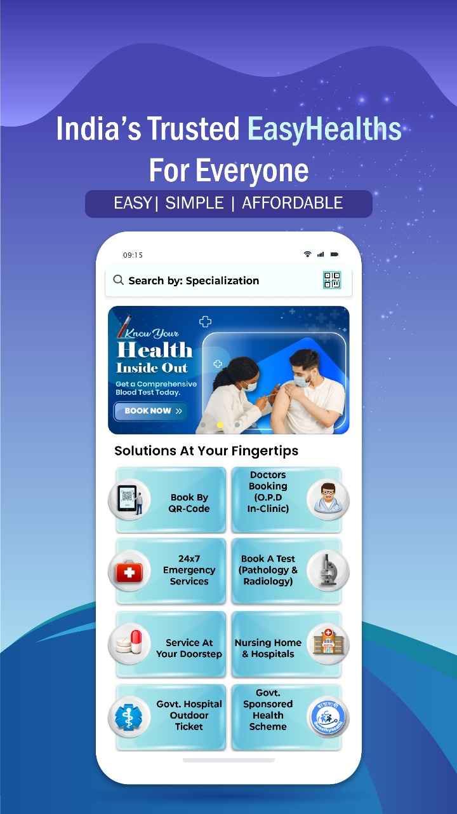

# Saket Kumar

**Lead Software Developer | React Native & Modern Web Solutions**

---

## 👋 Welcome!

Hello! I’m **Saket Kumar**, a dedicated Lead Software Developer specializing in **React Native** and modern web technologies. With extensive experience building scalable, reliable cross-platform applications, I am eager to expand my reach to international clients and deliver high-quality software solutions.

---

## 🛠️ Technology Stack & Skills

- **Mobile Development:** React Native (iOS & Android), JavaScript (ES6+), TypeScript  
- **Backend & APIs:** RESTful & SOAP APIs, Payment Gateway Integration (Stripe, PayPal)  
- **Databases:** Firebase Realtime Database, MySQL, SQLite  
- **DevOps & Deployment:** Google Play Store publishing, VPS Setup & Management  
- **Search & Analytics:** Elastic Search for advanced queries & SEO  
- **CMS & E-commerce:** Magento experience for business and inventory management  
- **State Management & Tools:** Redux, debugging, performance profiling  
- **Realtime Features:** Firebase-powered chat and real-time communication  
- **Others:** SAP integration for business analytics and workflows  

---

## 🚀 Project Highlights & Published Apps

### EasyHealths  
- All-in-one healthcare app for easy medical care access  
- Book doctor appointments offline  
- Schedule diagnostic lab tests with home sample collection  
- 24/7 medical services and emergency support (hospital beds, ambulance)  
- Real-time appointment tracking  
- Secure electronic health vault for prescriptions and medical records  
[Google Play Store Link](https://play.google.com/store/apps/details?id=com.healthezy)

#### Screenshots

### EasyHealthsBiz  
- Healthcare management app for doctors, clinics, hospitals, and labs  
- Manage appointments and diagnostic services efficiently  
- Real-time patient data access  
- Streamlined communication within the EasyHealths ecosystem  
- Helps improve healthcare operational workflows and patient care coordination  
[Google Play Store Link](https://play.google.com/store/apps/details?id=com.easyhealthb2b)

### EasyHealthsBiz Screenshots

### Jiffy by Spencers (formerly Spencers)  
- Retail and online grocery app by Spencer’s Retail Ltd, rebranded as Jiffy by Spencers  
- Wide product range: groceries, fresh produce, FMCG, personal care, appliances  
- Real-time offers and discounts  
- Customized shopping lists and flexible delivery slots  
- 3-hour quick delivery in major Indian cities  
- Omni-channel experience ensuring quality and convenience  
[Google Play Store Link](https://play.google.com/store/apps/details?id=com.bsl.spencers.activity)

---

## 🌍 Ready to Collaborate Internationally

Though most of my experience has been with domestic clients, I am fully ready and motivated to provide reliable, scalable, and maintainable software solutions for international projects. I understand global standards and best practices, aiming to deliver impactful software tailored to client needs worldwide.

---

## 📬 Contact Me

- **Email:** (saket.122022@gmail.com)
- **LinkedIn:** (http://www.linkedin.com/in/saket-kumar25)
- **Location:** India (Available for international remote opportunities)  
- **Languages:** English, Hindi  

---

> *“Committed to delivering high-quality software solutions that empower clients globally.”*

---

*Feel free to explore my pinned repositories and reach out to discuss how I can help bring your projects to life.*
